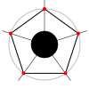

# Regular Polygons and Stars
{: .no_toc }

## Table of content
{: .no_toc .text-delta }

1. TOC
{:toc}

## Concepts

An euclidean polygon (both equiangular and equilateral) are described as a set
of n vertex evenly distributed along a circle. The connexion between each
vertex is done given a certain "density". A density of 1 connect all subsequent
vertex which gives a regular polygon:



Larger density produce polygrams a.k.a stars:


> **Note:** There are some debates on the mathematician community about
> [how some "degenerate" cases of polygram should be actually handled](https://en.wikipedia.org/wiki/Regular_polygon#Regular_star_polygons).
> In order to produce results that are more visually appealing, we are
> following the Coxeter convention.


## Declarative API

In order to ease the pain of handling such computation, SVG Extend provide an
extended declarative API for SVG elements `path`, `polygon` and `polyline` by
defining new attributes on those elements:

| Attribute | Value              | Default | Min | Max |
|:----------|--------------------|---------|-----|-----|
| `is`      | `n-star`           | _None_  |     |     |
| `cx`      | `-?[0-9]+`         | 0       | -∞  | +∞  |
| `cy`      | `-?[0-9]+`         | 0       | -∞  | +∞  |
| `vertex`  | `[3-9][0-9]*`      | 3       | 3   | +∞  |
| `r`       | `([0-9]+,)*[0-9]+` | 0       | 0   | +∞  |

### `is`

The `is` attribute let declare that an element will use our extended API.
It must have the value `n-star`.

> **Note:** HTML defines the `is` attribute as a way to declare
> [customized build-in elements](https://html.spec.whatwg.org/multipage/custom-elements.html#customized-built-in-element).
> As [the whole Custom Elements specification doesn't apply to SVG](https://github.com/w3c/webcomponents/issues/634),
> we use it as a bet on the future of the spec. If the spec support SVG at some
> point, we will be able to switch our implementation without changing the
> declarative API. If the spec never embrace SVG, then, it is a nice way to
> have a consistent API between HTML and SVG, even if the implementation
> is different.

### `cx` and `cy`

The `cx` and `cy` attribute define the centre of the circles to be used to draw
the shape. They behave exactly the same as those of the `circle` element. Their
default value is `0`.

### `vertex`

The number of vertex to distribute along each circle of the shape. Its minimum
and default value is `3`.

### `r`

A list of (comma or space separated) numbers representing the radius length of
each circles used to draw the shape. Its default value is `0` (No shape will
be drawn).


## Examples

### A simple octagon

```xml
<svg viewBox="0 0 100 100" xmlns="http://www.w3.org/2000/svg">
  <polygon is="n-star"
    cx="50" cy="50" vertex="8" r="40" />
</svg>
```

### A five-pointed star

```xml
<svg viewBox="0 0 100 100" xmlns="http://www.w3.org/2000/svg">
  <polygon is="n-star"
    cx="50" cy="50" vertex="5" r="40,20" />
</svg>
```
